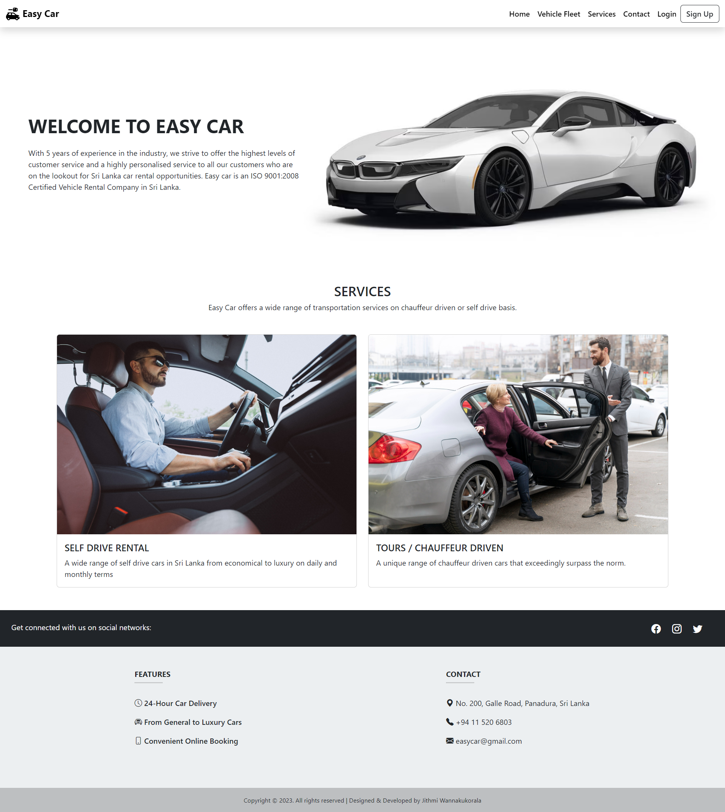
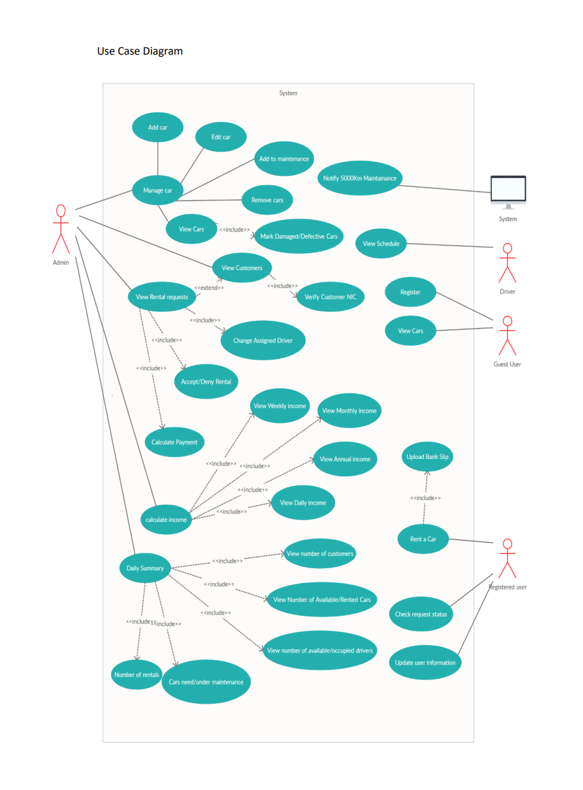

# Car-Rental-System

## Business Process

1. A customer comes to the website and register.
2. When registering, the customer has to upload a driving license, or an identity card to the
   system.
3. Then, the customer can select a car, Pick up time and date, and other required details.
4. The customer has to make the Loss Damage Waiver payment to the given bank account
   information of the car rental and upload the bank slip or the bank confirmation to the
   dedicated field in the renting view.
5. If a driver is requested by the customer, a driver is randomly assigned to accommodate the
   customer. (Drivers can view their weekly schedule from the website.)
6. After the customer completed the above steps, the admin can confirm or deny the rental
   request. However, the Loss Damage Waiver payment will be returned to the customer after
   handing over the car or if the customer cancels the rental request.
7. After the customer returns the car, he/she has to make the payment and the rental process
   will be finalized.
8. After the customer returns the car, a brief inspection will be done to the car and if the car is
   damaged or harmed, an appropriate amount will be deducted from the Loss Damage Waiver
   payment and the rest will be returned to the customer.
9. If the vehicle is unharmed the Loss Damage Waiver will be returned in full to the customer.
10. Engine faults and malfunctions in the car will not count when deductions are made from the
    Loss Damage Waiver.

## System Requirements

Admin Should be able to:

1. Have full access to the system.
2. Add and manage the details of the cars with the system. A car can have the following
   attributes.
- Brand (make. Ex: Toyota, Suzuki)
- Type (ex mini, luxury)
- Four images of the car. (Front View, Back View, Side View, Interior)
- Number of passengers
- Transmission type. (Manual, Auto)
- Fuel Type. (Ex. Diesel, Petrol)
- Prices for the rent durations.
  o Daily rate
  o Monthly rate
- Free mileage for the price and duration.
- Price for extra KM.
- Registration number.
- Color
3. Verify customer details with the Identity card or driving license by viewing them.
4. Either accept a rent request or deny it. However, if the request is denied, the customer
   should be notified with an acceptable reason for the denial.
5. Change the driver who is randomly assigned to a rental request and admin should be able to
   view the schedule of the driver by a specified time duration.
6. View the schedule for vehicles and should be able to sort them as available vehicles and
   rented vehicles by date.
7. View the details of the customers and only the management should be able to view the
   customer details due to the customer privacy policy.
8. Calculate the payment through the system after the vehicle is returned. Loss Damage Waiver
   and the rental fee will be calculated as two separate payments in the same rental case.
9. Calculate daily, weekly, monthly, and yearly income from the car rental.
10. Mark the damaged or defective vehicles unavailable until they are repaired and back to
   service.

Registered Users should be able to:

1. Log into the system using their username and password.
2. Place a rental request. When placing a rental request, the customer should be able to
   view/specify the car he needs, enter the pick-up and return date and time. The customer can
   specify pick up and return venues as either Easy Car Rental Premises or any other location
   according to his/her preference. Additionally, the customer should be able to specify
   whether he needs a driver or not.
3. Book more than one car. However, The Loss Damage Waiver should be paid separately for
   each car, and the bank confirmations should be submitted for verification.
4. View the status of the rental request, whether it is accepted or not and he/she should be
   provided with the contact information of the driver.
5. Update his/her username, password, contact information, and his driving license.

Guest users should be able to:

1. Register as a customer for the car rental service online. When registering, the customer
   should provide the following information.
- Email.
- New Password.
- NIC Number and a photo of customers NIC should be uploaded.
- Driving License number and a photo of customers driving license.
- Address.
- Contact Number.
2. View the details of the cars.
   A driver should be able to:
3. View the work schedule and the details of the rental requests that he/she is assigned to by
   logging into the system.

## 📌Use-case Diagram

## Objectives

Getting an approach to develop enterprise-level applications using Spring Web MVC
- Usage of frameworks for application development.
- Creating user interfaces for web applications.
- Handling Asynchronous requests.
- Handling REST-based services.
- Simplifies Java application development process with Spring.

## Built with
  
- Front End: Bootstrap
- Bach End: Spring MVC, Spring Data JPA, MySQL, Lombok, ModelMapper, Jackson

## LICENSE

See the [LICENSE](LICENSE) for more information.

